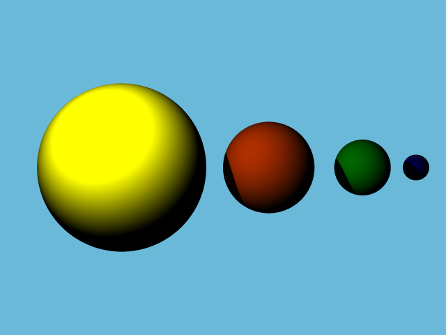

# 3D-Image-Renderer

## Table of Contents
1. [Introduction](#introduction)
2. [Requirements](#requirements)
3. [Running the program](#input-format)


## Introduction
This project simulates a basic ray tracing system where rays are cast from a camera into a 3D world containing spheres. The program computes the color of each pixel based on the intersection of rays with objects, considering lighting effects such as diffuse reflection and shadows.

The ray tracing algorithm uses vector mathematics to compute intersections, lighting, and shading for each pixel in the output image.


## Requirements
Before running the program, ensure that the following tools are available:
- A C compiler (e.g., GCC)
- The standard C library
- The `math.h` library for mathematical operations
- Install PPM to view images:
To view the image at its full resolution, you have some other options: [This website](https://www.cs.rhodes.edu/welshc/COMP141_F16/ppmReader.html), or if you use Visual Studio Code you can use [this extension](https://marketplace.visualstudio.com/items?itemName=ngtystr.ppm-pgm-viewer-for-vscode) to view them directly in the IDE. Make sure that the file extension is .ppm.

## Running the program

1) In the terminal, navigate to the repository. Run the command 'make scene'.
2) Run the command './scene src/input_file.txt output.ppm'
3) Open 'output.ppm' to view the generated image.

To customize the image, you must first understand the structure of the input file.
'input_file.txt' has the following structure:

```
<image width (int)> <image height (int)>
<viewport height (float)>
<focal length (float)>
<light position (3float)> <light brightness (float)>
<number of colors `m` (int)>
<color 1 (HEX)> <color 2 (HEX)> ... <color m (HEX)>
<background color index (int)>
<number of spheres `n` (int)>
<sphere 1 position (3float)> <sphere 1 radius (float)> <sphere 1 color index (int)>
<sphere 2 position (3float)> <sphere 2 radius (float)> <sphere 2 color index (int)>
...
<sphere n position (3float)> <sphere n radius (float)> <sphere n color index (int)>
```

You can change 'input.txt' to get various images such as the ones below:

#### Example 1

Input:
```
640 480
2.0
1.0
20.0 20.0 10.0 1000.0
4
0x1188EE 0xDD2266 0xDD7700 0x11CC66
0
3
2.0 0.0 -5.0 2.0 2
-2.0 0.0 -5.0 2.0 3
0.0 -102.0 -5.0 100.0 1
```

Output:


#### Example 2

Input:
```
640 480
2.0
5.0
0.0 20.0 0.0 500.0
5
0x97C4EB 0x88CC66 0xEB6E0A 0xEBBE0A 0xEB3EDA
0
4
0.0 -41.0 -18.0 40.0 1
0.4 1.0 -10.0 0.5 3
0.6 -0.3 -10.2 0.3 4
-0.4 -0.1 -10.5 0.7 2
```

Output:


#### Example 3

Input:
```
640 480
2.0
5.0
-10.0 10.0 -30.0 500.0
5
0x6ABADA 0xFFFF00 0xFF4500 0x00FF00 0x0000FF
2
4
-6.0 0.0 -50.0 5.0 4
3.0 0.0 -55.0 3.0 3
10.0 0.0 -60.0 2.0 1
15.0 0.0 -65.0 1.0 0
```

Output:



